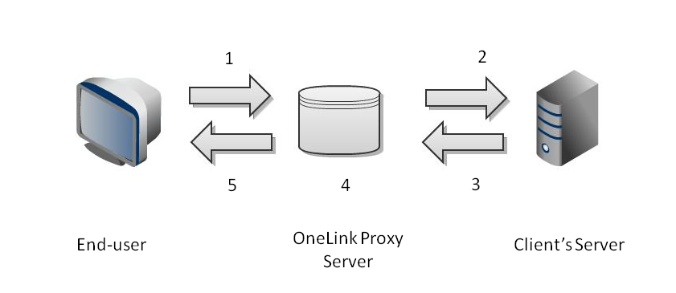

<!--
Processing tips: 
pandoc -f markdown -t json OneLink_API.md | runhaskell ./doInclude.hs | pandoc -f json -t markdown -o OneLink_API.md
Generating PDF
pandoc -f markdown --latex-engine=xelatex --template ~/tools/onedoc.latex -V geometry:margin=.75in -V fontsize=11pt -V mainfont=NimbusSanL-Regu OneLink_API.md -o OneLink_API.pdf
 
-->
About this guide
================

This document describes OneLink® API. The API enables real-time querying
of Translation Memory content so you can use it for other purposes —
such as email content, browsers, and third-party products or data that
may require translation.

**Note**: this is a temporary location.

This document is available on GitHub at
[OneLink-API](https://github.com/RoasterBoy/OneLink-API).

What is the OneLink API?
========================

The OneLink Platform can be configured as a proxy service to provide a
translated version of a website or invoked programmatically as an API to
provide translations. You can use these services independently or
together.

This document shows how the API can be used to return translations of
submitted content.

For example,

1.  A Spanish page request is made by the browser.

2.  The origin host responds by composing an English page, built using
    normal processes (i.e., CMS, API, Static Page, etc.).

3.  The composed page is sent to the OneLink API application code.

4.  The OneLink API code makes the appropriate requests from Translation
    Memory and the Parsing Engine to swap Spanish for English content.

5.  The OneLink® Platform composes the Spanish page, and returns it to
    the origin server.

6.  The origin server returns the Spanish page back to the browser that
    requsted it.

This model achieves anonymity from the typical proxy relationship since
it is not connected to the exchange between browser and server. The
server itself appears in every way as the source of the translated site.
When content is requested from the server it is served directly to the
client’s browser with no interim contact with a OneLink® proxy. Of
course, to implement this you would host the OneLink® Platform directly
inside your IT architecture. This is just one example, and you can use
the API without hosting the platform yourself.

Getting Started
===============

Why would you use the OneLink API?
----------------------------------

Translation needs are diverse within most companies. Requirements may
come from a variety of sources and go to various target applications.
Typically, clients’ website content and external applications like email
are considered separately, yet both require translated content to
function in a global environment. Website content, once translated,
seems to span a company’s entire ERP cycle from marketing and sales
through to training and support.

### Examples:

-   You can translate selected content that can then be merged with your
    customers' personal data. The customer data never leaves your site.

-   You can translate internal emails.

-   Use the API to translate selected portions of a page (instead of
    running the whole website through the OneLink proxy service).

-   Build a translation interface to a custom CMS.

-   Submit pre-published pages to the API. The pages are
    translated completely. When publishing the English content (and
    using the OneLink proxy), the target language sites will already
    have the translated content.

-   Capture unpublished content for translation by submitting it to
    the API.

Solution
--------

Translations.com’s OneLink® offers both proxy-based website translation
and an API for general purpose real-time translation. Translations can
be sourced through the API and delivered either to a website or to any
number of external applications, if that content has been captured,
translated, and resides in Translation Memory. The OneLink® Platform is
required to implement the API. There are various flexible ways to set up
that platform to fulfill our clients’ needs, requirements, and goals.

The OneLink® API leverages the following components of the OneLink®
Platform:

-   Real-time parsing of web related mime-types (HTML, XML, JS,
    JSON, etc.)

-   Real-time translation memory (TM) lookups for segment/sentence-level
    replacements from source to target language

-   Ability to mark-up source content with OneLink® classes to prevent
    certain content from being translated

-   Ability to capture segments that are missing from the TM and/or
    backfill with real-time machine translation

-   Sub-second response time

About the OneLink Proxy
-----------------------

The OneLink Proxy is a special proxy that localizes websites virtually.
A traditional localization process requires that you maintain your
original web content and synchronize changes with the localized content
(in multiple languages). The OneLink proxy simplifies this process by
applying translation on-the-fly.

The proxy server sits in between the end-user’s browser and the client’s
servers.

1.  The user visits es.acme.com. The user’s browser sends a request that
    will go to the OL proxy server.

2.  The OL proxy server in turn passes a request to the origin server
    requesting the source file.

3.  The origin server responds with the requested file.

4.  The OL server “localizes” the file.

5.  The OL server responds to the browser with the localized version of
    the requested file.



Note that steps 3 through 5 are not “seen” by the end-user’s browser.
Rather, the browser is requesting a file from the OL server and the OL
server is responding with that file just as any other server would.
OneLink steps happen with almost zero negative effect on performance for
the end-user.

OneLink API Implementation
==========================

POST Request
------------

Your application code sends POST requests to the OneLink® API using
parameters that are specified on the next page. Note that you will need
to understand where the OneLink API server lives. If the OneLink API
server is installed on your LAN, the request may look like this:

`https://10.20.30.40/OneLinkOTX/page/requesting/data.html`

If the OneLink API server is installed in one of our colocation
facilities, the request may look like this:

`https://es.acme.com/OneLinkOTX/page/requesting/data.html`

Using your application code, you should create a POST request with the
following request headers and post parameters:

### Required Request Headers

> **Host:** *your-virtual-host* (see below)
>
> **Content-Type:** application/x-www-form-url-encoded (all POST
> requests have this header)

### Required Post Parameters

> **otx\_account**=account number, account password. This contains the
> account number and password for the OneLink API.
>
> **otx\_mimetype:** The mime-type of the content being uploaded. This
> tells the OneLink® Proxy how to interpret the incoming information.
> The only supported types as of right now are the following:

> -   **text/html**: This page will be parsed as a normal HTML page by
>     the rules defined for the virtual host.
>
> -   **text/xml**: This data will be parsed normally as XML content
>     following the logic defined for the virtual host.
>
> -   **text/javascript**: Incoming data will have our custom JavaScript
>     parser applied.
>
> -   **text/json** or **text/plain**: The JSON data will be filtered
>     through our custom JSON parser logic.
>
> -   **text/segment** or **application/json**: This refers to a single
>     segment of text that will not be parsed with rules, it will only
>     be translated.
>
> **Note:** any foreign mimetype not listed above will cause the OneLink
> API to respond with HTTP-205 and the original document untouched. The
> same thing will happen if the mimetype is not set.
>
> **otx\_service:** *Optional.* *Defaults to “tx”*. Values are as
> follows:
>
> -   **tx:** Performs normal translation as defined for the
>     virtual host.
>
> -   **smt:** Performs SMT (simple machine translation).
>
> -   **wmt:** Performs WebMT (WorldLingo machine translation).
>
> -   **tx+smt:** Performs normal translation, but any segments not
>     found in the TM are translated using simple machine translation
>
> -   **tx+wmt:** Performs normal translation, but any segments not
>     found in the TM are translated using WorldLingo machine
>     translation
>
> -   **parse:** Parses and outputs segmentation and token logic (used
>     primarily for debugging)
>
> **otx\_content:** the content to be translated. Note that in the event
> that the content contains non-ASCII characters, the base encoding must
> be UTF-8 (not Windows-1252, nor ISO-8859). In order to be passed as
> POST data, the content must also be “form-url-encoding.” Most
> application frameworks will automatically form-encode data if they
> know you are sending a POST request.

OneLink API Responses
---------------------

The response is a standard HTTP response and the status code is any one
of the following:

> **HTTP-200:** Success
>
> **HTTP-205:** The mime type not supported, original document is
> returned untouched
>
> **HTTP-401:** Protocol error: missing or malformed required header
>
> **HTTP-402:** Feature is not enabled for specified host
>
> **HTTP-403:** Invalid account number or invalid account password
>
> **HTTP-404:** Translation Memory (TM) is not started or service is not
> available
>
> **HTTP-405:** Attempted to use HTTP instead of HTTPS from a public IP
> address

Following an HTTP-200 response, the rest of the response header will
look like the following:

> **Content-Type:** The mime type of the response (usually the same as
> the mime type that came in)
>
> **Content-Length:** Number of bytes in the translated document
>
> **Encoding:** gzip, etc. (based on site configuration rules)

The following response headers are included whenever the request
includes **X-OneLink-Headers** and “**translation”** is in the
comma-delimited list of flags:

> **X-OneLinkSegments:** *nn* (the number of translatable text segments
> in the content)
>
> **X-OneLinkTranslated:** *nn* (the number of text segments translated)
>
> **X-OneLinkTxPercent:** *nn* (percentage of text segments translated)

**Sent to the OneLink API:**

    Host: es-otx.onelink-poc.com'
    Content-Type: application/x-www-form-urlencoded
    Content-Length: 123 

    otx_account=otx,otxpass&otx_mimetype=text/plain&otx_service=tx&otx_content=Hello%20World

**Received from the OneLink API:**

    HTTP/1.1 200 OK
    Content-Type: text/plain
    Content-Length: 12
    Encoding: utf8
    Hola Mundial

The following example shows how to send a request to the OneLink API via
`curl`.

**Note**: some of the `curl` examples in this document exceed 80 characters. Be careful when uou are copying and pasting into your terminal window. Make sure that line continuation characters, if needed, are in place.

```
curl -k --header 'Host: es-otx.onelink-poc.com' --request POST 'https://es-otx.onelink-poc.com/OneLinkOTX/' --data "otx_mimetype=text/html&otx_account=otx,otxpass&otx_service=tx&otx_content=Hello World" ; echo

```
The expected result is

    ¡hola Mundo

Appendix: Code Samples
======================

The following examples show you some basic examples of the OneLink API
in Python, Java, and PHP.

Python example:
---------------

``` {include="example.py"}
#!/usr/bin/env python
# -*- coding: utf-8 -*- # Import extensible library for opening URLs
import urllib2, urllib
# Segment for translation
contentForTx = "Acme Corp has the largest selection of dynamite and anvils on the market."
# The hostname of the project that contains the TM and OTX account
virtualHostName = "es-otx.onelink-poc.com"
# The hostname of the server the project is contained on
physicalHostName = "es-otx.onelink-poc.com"
# Set the parameters of the request, encode with url encoding.
params = urllib.urlencode({'otx_mimetype': 'text/html',
 'otx_account' : 'otx,otxpass', 'otx_service' : 'smt', 'otx_content' : contentForTx})
# Set the host header
headers = {"Host": virtualHostName}
# Make the request object passing in the parameters and headers
req = urllib2.Request("https://"+physicalHostName+"/OneLinkOTX/", params, headers)
# Execute the request
response = urllib2.urlopen(req)
# Read the response
htmlData = response.read()
print ":: Content for translation : "+contentForTx
print ":: Received translated content: "+htmlData
```

See [example.py](./example.py)

Use the following command:

    ./example.py 

The expected result is:

    :: Content for translation : Acme Corp has the largest selection of dynamite and anvils on the market.
    :: Received translated content: Cumbre Corp tiene la más grande selección de dinamita y yunques en la mercado.

PHP example:
------------

``` {include="example.php"}
<?php
if($argc<2){
    echo "\n usage: php getOTX.php content service\n";
    exit;
}

// Setup Defaults
$otx_account = 'otx,otxpass';
$otx_mimetype = "text/html";

// Fill from cli
$otx_content =                 $argv[1];
$otx_service = ( isset($argv[2])) ? $argv[2] : "smt";

// Setup data for http query 
$url = 'https://es-otx.onelink-poc.com/OneLinkOTX/';
$data = array(
                                'otx_account' => $otx_account
                                ,'otx_service' => $otx_service
                                ,'otx_mimetype' => $otx_mimetype
                                ,'otx_content' => $otx_content
                                                                
);
// Setup stream options
$options = array(
    'http' => array(
        'header'  => "Content-type: application/x-www-form-urlencoded\r\n",
        'method'  => 'POST',
        'content' => http_build_query($data),
    ),
);

// Create stream , get contents 
$context  = stream_context_create($options);
$result = file_get_contents($url, false, $context);

// Results
echo "\n    content:" . $otx_content;
echo "\n translated:" . $result ."\n";
?>
```

See [example.php](./example.php)

Usage: `php example.php "<p>I am going for a long walk</p>" smt`

The expected result is:

        content:<p>I am going for a long walk</p>
        translated:<p>Voy para una caminata larga</p>

Appendix: OneLink API Testing
=============================

There is a OneLink API service you can test with Spanish. It uses
Machine Translation so be cautioned that the translation is not reliable
and is used only for testing purposes.

The domain is: [es-otx.onelink-poc.com](es-otx.onelink-poc.com)

The username is: `otx` and password is: `otxpass`

Rather than make separate calls for each segment you want to translate
you can send the server JSON or XML.

A simple Curl test to the OneLink API Service:

    curl -k --header 'Host: es-otx.onelink-poc.com' --request POST 'https://es-otx.onelink-poc.com/OneLinkOTX/' --data 'otx_mimetype=text/html&otx_account=otx,otxpass&otx_service=smt&otx_content="<p>I am going for a long walk</p>"'

This is expected to return the translated segment:

    <p>Yo soy va para un largo caminar</p>

You can also send several segments to the service for translation by
using JSON or HTML

In this case the server must be configured to translate specific data.
This is done because most servers use JSON and XML to transmit not only
translatable segments but code and tag information.

For testing we have added a global ‘otxtest’ tag to the OneLink
translation stack. Anytime it finds this in the tag stack, it will
translate the content inside it.

For example, the command passes JSON with 3 elements to the server.
Because these are contained within an otxtest element it will translate:

    curl -k --header 'Host:es-otx.onelink-poc.com'\
    --request POST 'https://es-otx.onelink-poc.com/OneLinkOTX/' \
    --data 'otx_mimetype=text/json&otx_account=otx,otxpass&otx_service=tx&\
    otx_content={ otxtest: { "data1":"i see the cat","data2":"chasing the dog",\
    data3:"in the yard" }}' ; echo

This is the expected response:

    { "otxtest": { "data1": "veo el gato", "data2": "perseguimiento del perro", "data3": "en la yarda" } }

The same is true for XML (Note modified mime type)

    curl -k --header 'Host:es-otx.onelink-poc.com'\
    --request POST 'https://es-otx.onelink-poc.com/OneLinkOTX/'\
    --data 'otx_mimetype=text/xml&otx_account=otx,otxpass&\
    otx_service=tx&otx_content=<otxtest>\
    <foo>You have to learn the rules of the game.</foo>\
    <bar>And then you have to play better than anyone else.</bar></otxtest>' ; echo

This is the expected result:

    <otxtest>
    <foo>Usted tiene que aprender las reglas del juego.</foo>
    <bar>Y entonces usted tiene que jugar mejor que cualquier persona.</bar></otxtest>
